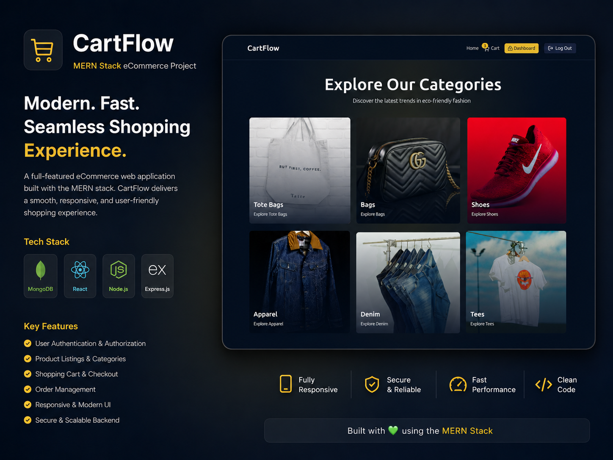
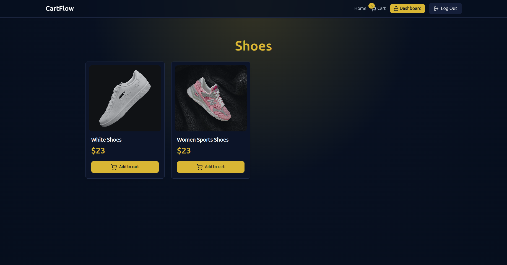
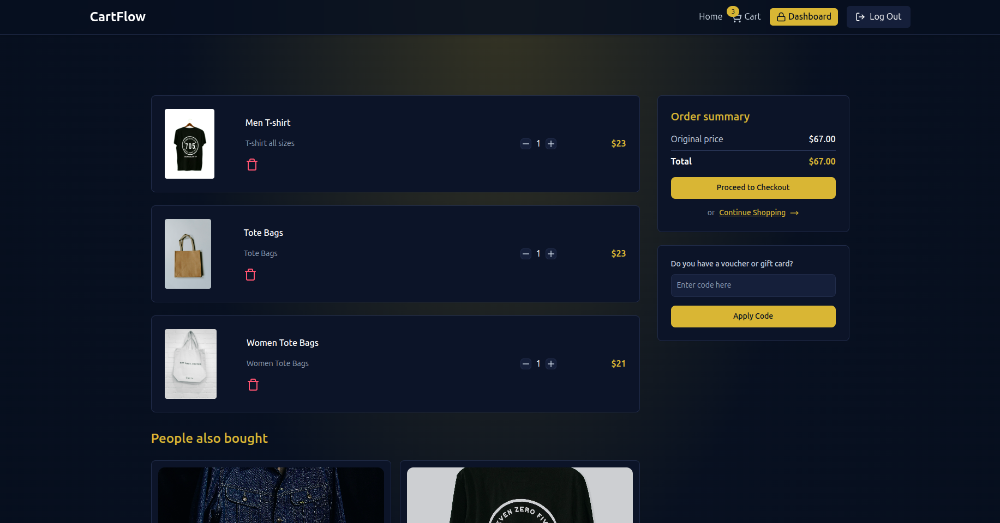
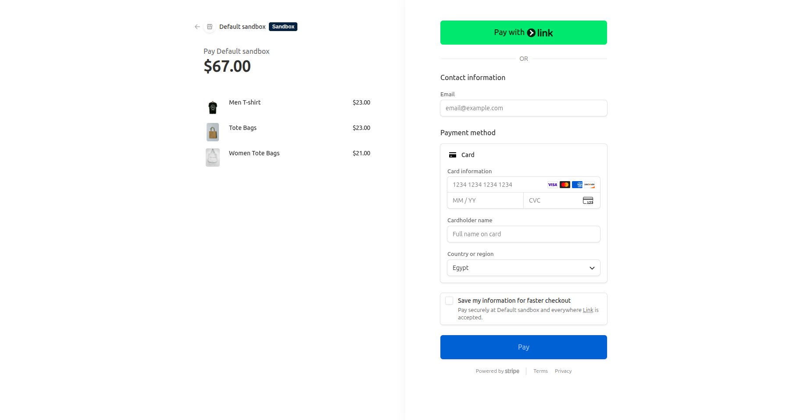
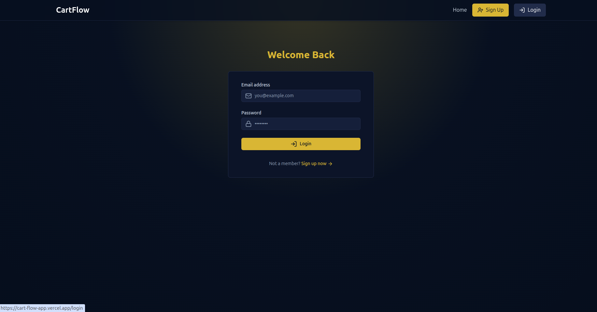
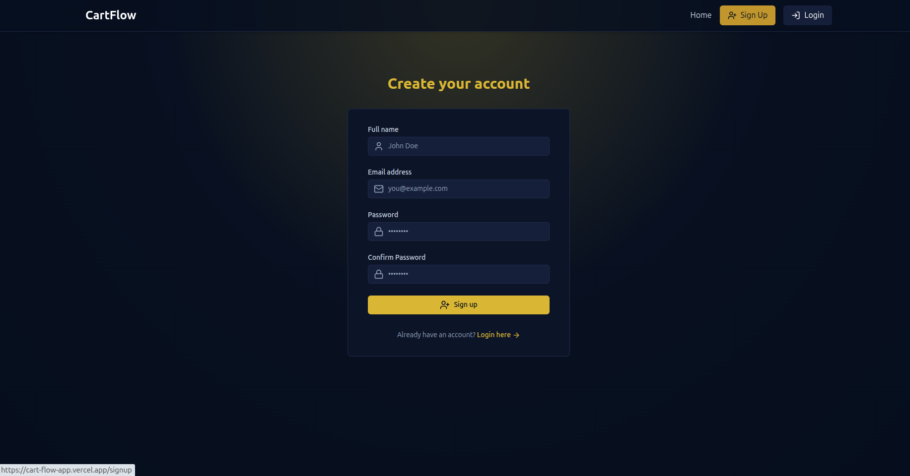
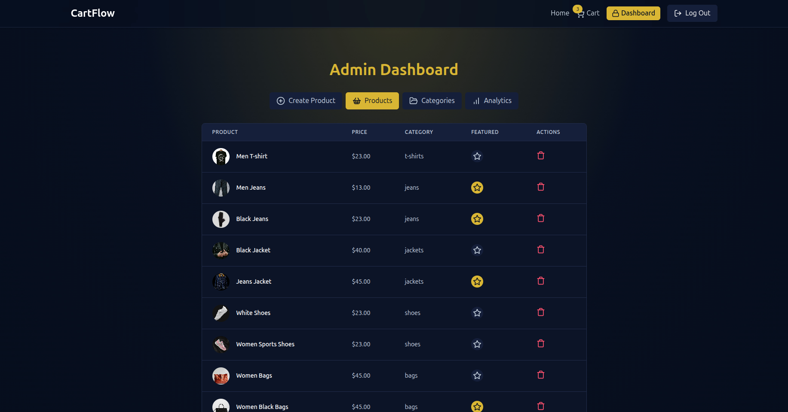
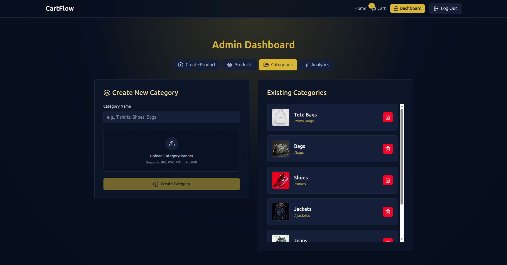

# CartFlow

CartFlow is a full-stack e-commerce application built with the MERN stack. It includes product browsing, category navigation, cart flow, Stripe checkout, authentication, and an admin dashboard for managing the store.

## Features

- User authentication with signup, login, and secure session handling
- Product browsing with category-based filtering
- Shopping cart
- Stripe-powered checkout flow
- Admin dashboard for store management
- Category and product management
- Analytics and sales overview
- Redis integration for caching and performance
- Cloudinary support for image uploads

## Demo

### CartFlow



### Categories



### Cart



### Stripe Checkout



### Login



### Register



### Admin Dashboard



### Categories Dashboard



## Tech Stack

- Frontend: React, Vite, Tailwind CSS, Zustand, React Router
- Backend: Node.js, Express, MongoDB, Mongoose
- Payments: Stripe
- Storage: Cloudinary
- Cache: Redis

## Setup

### 1. Clone the repository

```bash
git clone https://github.com/rawdaymohamed/cart-flow
cd cart-flow
```

### 2. Configure the backend

Create a `.env` file in the `server` directory:

```bash
PORT=5000
MONGO_URI=your_mongo_uri

UPSTASH_REDIS_URL=your_redis_url

ACCESS_TOKEN_SECRET=your_access_token_secret
REFRESH_TOKEN_SECRET=your_refresh_token_secret

CLOUDINARY_CLOUD_NAME=your_cloud_name
CLOUDINARY_API_KEY=your_api_key
CLOUDINARY_API_SECRET=your_api_secret

STRIPE_SECRET_KEY=your_stripe_secret_key
CLIENT_URL=http://localhost:5173
NODE_ENV=development
```

### 3. Install dependencies

```bash
cd server
npm install

cd ../client
npm install
```

### 4. Run the app

Open two terminals:

```bash
# Terminal 1
cd server
npm run dev
```

```bash
# Terminal 2
cd client
npm run dev
```

## Notes

- The frontend runs on Vite’s default port, usually `http://localhost:5173`
- The backend runs on the port defined in `PORT`
- Make sure the backend environment variables are configured before testing authentication, checkout, or admin features
